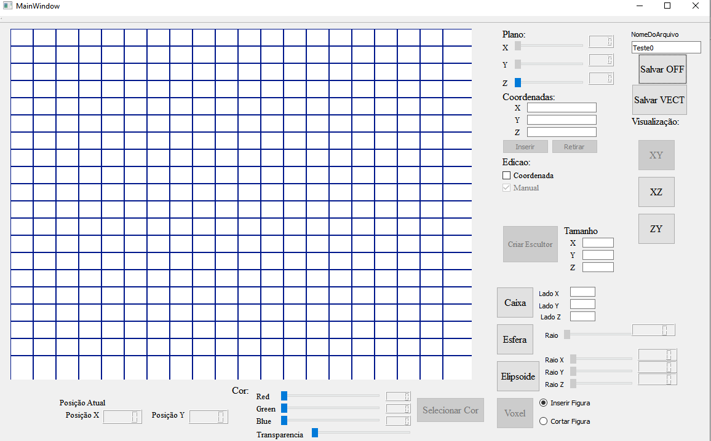

# QtSculptor
## Descrição do projeto
  Esse projeto tem por objetivo criar imagens tridimensionais formadas por cubos. O projeto contém uma interface gráfica
 desenvolvida no Qt para auxiliar a criação de figuras geométricas de forma intuitiva para o usúario. As figuras geométricas
 padrões do programa possibilitam a criação de ellipsoides, esferas, caixas e um único ponto.A criação das formas geometricas 
 pode ser feita ao clicar em uma célula disponível no espaço destinado para desenho, ou inserindo as coordenadas desejadas para 
 o centro da figura tridimensional que se deseja inserir no desenho.
    Além das formas geometricas tridimensionais o usuario pode escolher os valores da cor no padrão RGB e também a transparência 
  que deseja dar às figuras que está desenvolvendo. O projeto possibilita salvar o desenho feito em arquivos do formato OFF e VECT
  que podem ser abertos em softwares como o meshlab e o geomview.
## Observações importantes
  *Os Espaços para texto disponiveis para dados numéricos como as dimensões do Escultor, lados da caixa ou coordenadas, só estão 
  preparados para lidar com dados numéricos;
  
  *Ao apertar na opção de criar o Escultor sem ter delimitado as dimensões o programa utiliza 20 unidades de medida como padrão;
  
  *Os lados da caixa devem ser digitados no espaço devido antes de apertar o botão da operação.
  
  *Ao apertar na operação de caixa sem estabelecer as dimensões desejadas o programa utiliza 10 unidades de medida como padrão;
  
  *Antes de inciar o programa é importante ir até as operações de salvar o arquivo e adaptar o diretorio de salvamento para os 
  parametros do computador do usuário;
  
  *O programa tem tamanho fixo em tela.
 ## Funcionamento
 
       Ao executar o programa ele terá as caracteristica da imagem acima. No inicio da execução todos os botões, com excessão do criar
  Escultor e dos botões de salvar, começam desabilitados, além dos botões os slider verticais, 'checkboxes' e radiu buttons também 
  começam desabilitados para usuário.
        Nesse momento o usuário deve informar no espaço de titulo "tamanho" quais serão as dimensões do escultor que ele deseja criar.
   Lembrando que os dados passados no espaço de texto devem ser dados numéricos e que se nenhum parametro for repassado ao clicar 
   no botão "criar Escultor" todas as dimensões terão como tamanho padrão o número 20.Vale ressaltar que pelo tamanho do programa 
   ser fixo, selecionando acima de 35 unidades para as dimensões o widget que desenha as células pode ganhar caracteristicas 
   peculiares por causa das equações por trás da criação das células de desenho no widget.
       Só é possível criar um escultor durante o tempo de  execução do programa pois ao clicar para criar o escultor o botão fica 
   desabilitado á medida que todas as outras funcionalidades do programa são habilitadas para o usuário utilizar. 
   
 
        Após criado o escultor o programa seleciona como padrão a operação de colocar voxels na estrutura do desenho, seleciona também o
  Plano XY como padrão inicial e desmarca a opção de inserir a figura por coordenada.
        Os displays da posição atual informão qual é a coordenada da célula onde o mouse está posicionado de acordo com o plano que está
  Selecionado. Esse espaço sempre mostrará posição X como referência para o endereço horizontal da célula,(Esquerda para Direita), e
  mostrará Y como referência para o endereço vertical da célula(Cima para baixo).
        Os parametros do desenho que são regulados pelos sliders tem valor atualizado toda vez que há uma mudança nos valores desses parametros, entretanto,  as dimensões da caixa só podem ser escolhidas no momento em que a operação é selcionada já portanto os 
campos para informar as dimesões da caixa devem estar preenchidos antes de clicar no botão da operação.
       O programa utiliza os RadiuButtons "inserir figura" e "cortar figura" para administra se a operação está recortando o desenho ou
 Está inserindo novas figuras. Quando uma operação é selecionada o botão fica desabilitado para deixar intuitiva a noção de qual é o 
 tipo de figura atual com a qual se está trabalhando.
      No canto superior Direito Há sliders com título "Plano", esses sliders permitem ao usuário passear nas coordenadas que não estão
 sendo exibidas na telas, por exemplo: se o plano atual é o XY o slider do plano Z estará habilitado para o usuário poder caminhar nas 
 Coordenadas de Z enquanto o plano XY está em evidência no quadro de desenho.
      Ao clicar no CheckBox "Coordenada" em baixo do título "Edição" o programa permite que o usuário digite as coordenadas onde deseja 
 Inserir a figura atual com a qual está trabalhando.
      Ao clicar na tela de desenho o programa preenche as células que formam a figura com ellipses da cor que está selecionada atualmente nos sliders RGB. 
 
